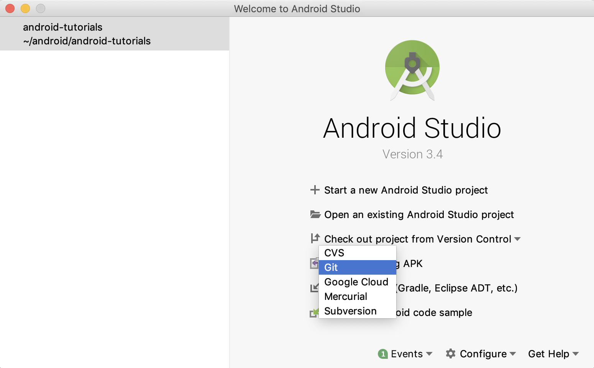
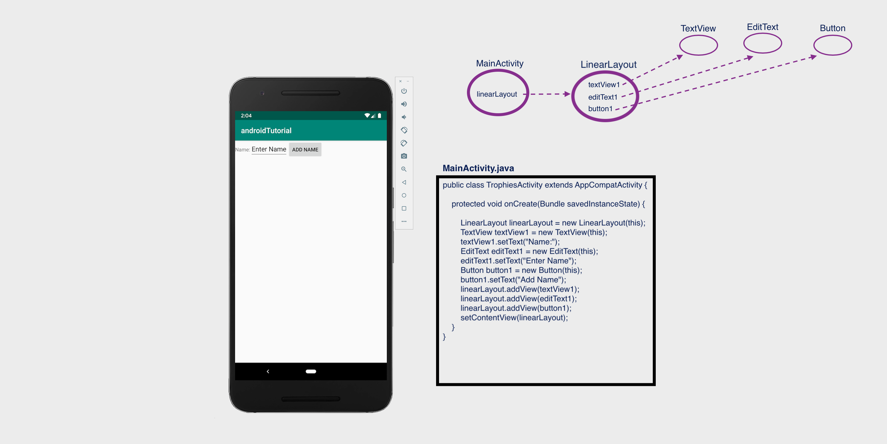
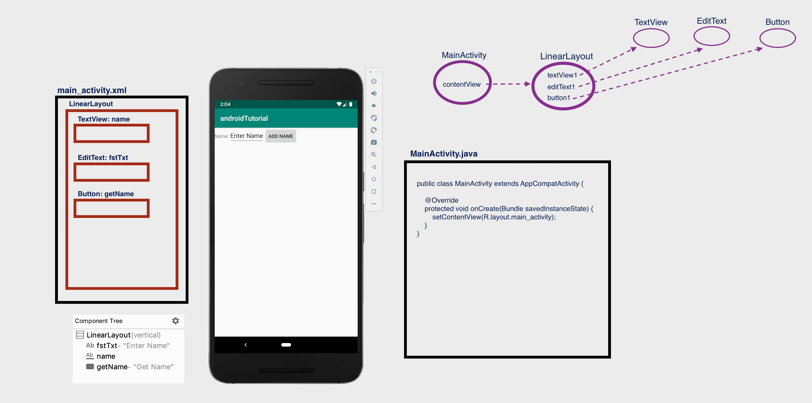
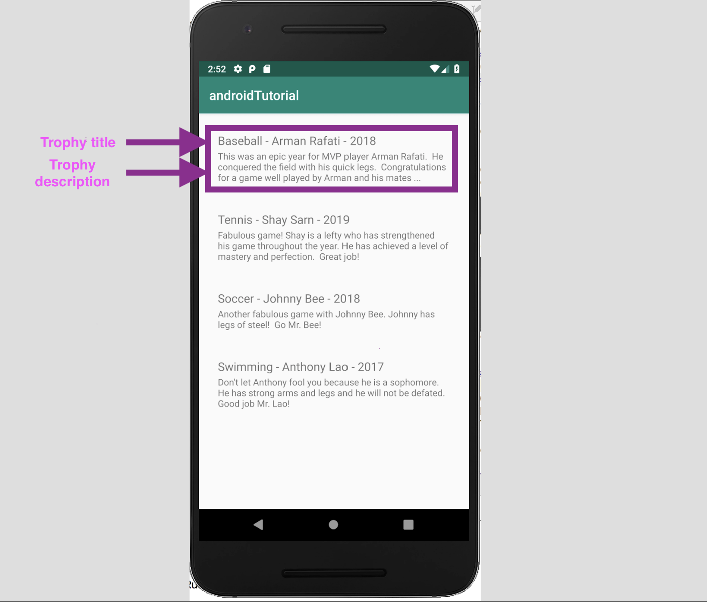
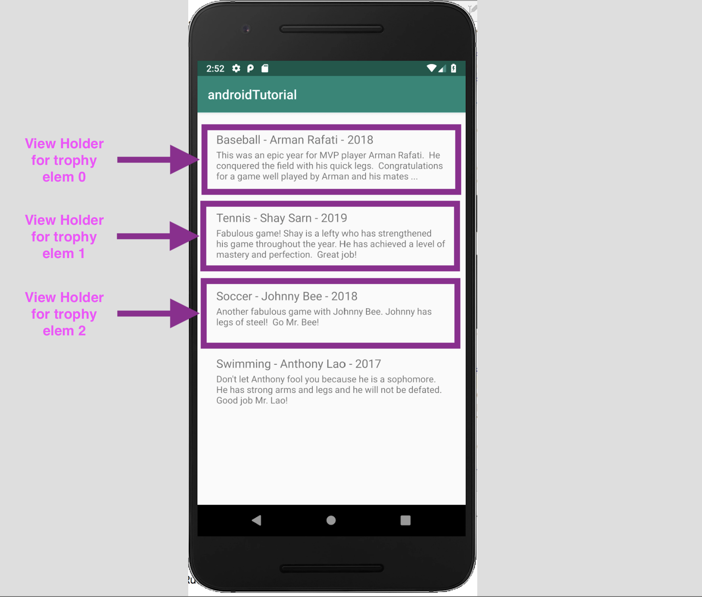
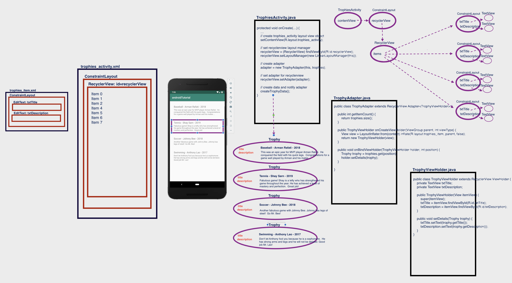
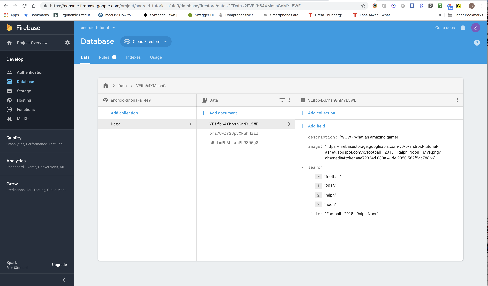

# Android Tutorial

In the tutorial we will be learning about:

- **basic concepts**
- **recyclerview**
- **search**
- **firebase**
- **firebase-search**

The content in this repository will be mostly based off of the Android tutorial in the following link:
https://www.tutlane.com/tutorial/android/android-tutorial.

The above tutorial is quite comprehensive and you're welcome to explore it, but if you find yourself getting
a bit overwhelmed then in this repository we will try to focus on basic hands-on examples.

From the above tutorial, the following sections are good to skim over for a general idea but you don't need to
delve deeply into them:
(It's ok to skip them for now)

- Android Introduction - What is Android?  https://www.tutlane.com/tutorial/android/android-introduction
- Android Architecture  https://www.tutlane.com/tutorial/android/android-architecture

## Android installation

If you haven't installed Android Developer Studio please do so by following the instructions below:

- Android Development Environment Setup https://www.tutlane.com/tutorial/android/android-development-environment-setup
- Android Studio Installation: https://www.tutlane.com/tutorial/android/android-studio-installation-for-development-environment

## Markdown Navigator by Vladimir Schneider

Readme files (README.md) can be viewed in Android Studio using Markdown Navigator plugin by installing it as follows:

- Go to **Android Studio** -> **Preferences** -> **Plugins**
- Search for **Markdown Navigator**
- Click on **Install**
- **Restart** **Android Studio**
- Use **Markdown Navigator by Vladimir Schneider**

## Android Hello World App Example

The following link explains how to create your first Android app.

https://www.tutlane.com/tutorial/android/android-hello-world-app-example

In the above link, you will learn how to create a new project with an Empty Activity.

**_IMPORTANT_**:  Whenever you create a new project with an Empty Activity, always remember to check the checkbox "use androidx.* artifacts".

You will be exposed to files and concepts which will be explained in more details later.
For now, just try to remember the following pieces, you don't need to understand them in detail now:

 - an **Android layout file**, trophies_activity.xml (*app/app/src/main/res/layout/trophies_activity.xml*),
 - an **Android activity file**, TrophiesActivity.java (*app/app/src/main/java/com/example/androidtutorial/TrophiesActivity.java*)
 - **Android Manifest file**, **AndroidManifest.xml** (*app/app/src/main/AndroidManifest.xml*)
 - Android emulator
 - running the Android app

**_HINT_**: in Android Studio, use Cmd-Shift-O (or go to "Navigate" -> "File") and type TrophiesActivity.java or trophies_activity.xml (or any file name) to open a file.

## Clone android-tutorial github repository assigned to you

At this point, if you haven't done so already, clone the android-tutorial github repository.
You should have received an invitation in your email account.

- Open Android Studio

- Select **Checkout project from version control** -> **Git**



- In **Clone Repository** -> type the URL to the android-tutorial github repository

- Select defaults on all other pages

## Open android-tutorial in Android Studio

If you have already cloned the android-tutorial github repository then open it:

Open an existing Android Studio project (or File -> Open) and select **android-tutorial**

## Open readme (README.md) file in Android Studio (Command - Shift - O - README.md)

This readme file (README.md) can be viewed in Android Studio using Markdown Navigator plugin by installing **Markdown Navigator** by Vladimir Schneider (see instructions above).

## Android mobile app

A **mobile app** consists of pages (or screens) containing UI (user interface) elements.

For example, a **mobile app** can have a login page and a home page.  A login page can consist of UI elements like a
text edit box where the user enters his/her username, a password box where the user enters his/her password, and
a button that the user clicks to login.
A home page to the mobile app could have a text box with a description of the app and an image with some nice image.

Following are some common UI elements used in a screen/page which you may recognize:

- TextView
- EditText
- Button
- CheckBox
- RadioButton
- ImageButton
- Progress Bar
- Spinner

The View is a base class for all UI components in android. For example, the EditText class is used to accept the input from users in android apps, which is a sub class of View.

## Android Activity

In android, an **Activity** represents a single page with a user interface (UI) of an application.

Generally, the android apps will contain multiple pages and each page of our application will be an extension of Activity class.
By using activities, we can place all our android application UI elements in a single page.

## Android View and ViewGroup with Examples

In android, a **layout** is used to lay out and organize the UI elements in an **activity** (page/screen).
A **layout** will hold the UI elements and will help you in organizing the UI elements.

Following are some examples of layouts:

- Linear Layout
- Relative Layout
- Table Layout
- Frame Layout
- Web View
- List View
- Grid View

take a look at the following link to get an idea of the different layouts:
https://www.tutlane.com/tutorial/android/android-view-and-viewgroup-with-examples

**_IMPORTANT_**:
 
The **View** is a base class for all UI components in android. 
For example, the EditText class is used to accept the input from users in android apps, which is a sub class of View.

The **ViewGroup** is a subclass of **View** and it will act as a base class for layouts and layouts parameters. 

 
## AndroidX Overview

**AndroidX** is a major improvement to the original Android Support Library.

**_IMPORTANT_**:: Whenever we create a new project, when we select an Empty activity, always check the checkbox "use androidx.* artifacts".

for more information see https://developer.android.com/jetpack/androidx

*******************************************************************************************************************
# Open project 'ui-elements-runtime'
*******************************************************************************************************************

## UI Elements

see https://www.tutlane.com/tutorial/android/android-ui-controls-textview-edittext-radio-button-checkbox

In android, we can define a UI in two ways:

- Create UI elements at runtime
- Declare UI elements in XML

The android framework will allow us to use either or both of these methods to define our application’s UI.

## Create UI Elements at Runtime

To create UI elements at runtime, we need to create our own custom View and ViewGroup objects programmatically with required layouts.

Following is the example of creating an UI elements (TextView, EditText, Button) in LinearLayout using custom View and ViewGroup objects in
an activity programmatically.

*app/app/src/main/java/com/example/androidtutorial/MainActivity.java*
```
public class TrophiesActivity extends AppCompatActivity {
    @Override
    protected void onCreate(Bundle savedInstanceState) {
        super.onCreate(savedInstanceState);
        LinearLayout linearLayout = new LinearLayout(this);
        TextView textView1 = new TextView(this);
        textView1.setText("Name:");
        EditText editText1 = new EditText(this);
        editText1.setText("Enter Name");
        Button button1 = new Button(this);
        button1.setText("Add Name");
        linearLayout.addView(textView1);
        linearLayout.addView(editText1);
        linearLayout.addView(button1);
        setContentView(linearLayout);
    }
}
```


**_HINT_**: in Android Studio, use Cmd-Shift-O (or go to "Navigate" -> "File") and type MainActivity.java to see the above code, and
run the app.




*******************************************************************************************************************
# Close project 'ui-elements-runtime' and go back to original project 'android-tutorial'
*******************************************************************************************************************

*******************************************************************************************************************
# Open project 'ui-elements-xml'
*******************************************************************************************************************

## Declare UI elements in XML

In android, a page layout is created in XML similarly as web pages are created in HTML.

The layout file must contain only one root element, which must be a View or ViewGroup object.
Once we define root element, then we can add additional layout objects or widgets as child elements to build the
View hierarchy that defines our layout.

Following is an example of defining some UI elements (TextView, EditText, Button) in an XML file (main_activity.xml)
using LinearLayout.

*app/app/src/main/res/layout/main_activity.xml*
```
<?xml version="1.0" encoding="utf-8"?>
<LinearLayout xmlns:android="http://schemas.android.com/apk/res/android"
    android:orientation="vertical"

    android:layout_width="match_parent"
    android:layout_height="match_parent">
    <TextView
        android:id="@+id/fstTxt"
        android:layout_width="wrap_content"
        android:layout_height="wrap_content"
        android:text="Enter Name" />
    <EditText
        android:id="@+id/name"
        android:layout_width="wrap_content"
        android:layout_height="wrap_content"
        android:ems="10"/>
    <Button
        android:id="@+id/getName"
        android:layout_width="wrap_content"
        android:layout_height="wrap_content"
        android:text="Get Name" />
</LinearLayout>
```

**_HINT_**: in Android Studio, use Cmd-Shift-O (or go to "Navigate" -> "File") and type main_activity.xml to see the above xml code.

Also, in file TrophiesActivity.java, method **setContentView(R.layout.main_activity)** is called to **render** the layout file.
Rendering a layout means that the activity will be showing the UI design (with the UI elements) written in the xml file.

In method call **setContentView(R.layout.main_activity)**

- R means Resource

- layout means design

- main_activity is the xml you have created under res->layout->main_activity.xml

For a more detailed explanation of setContentView method, see https://androidride.com/what-setcontentview-android-studio/

**_HINT_**: in Android Studio, use Cmd-Shift-O (or go to "Navigate" -> "File") and type ActivityMain.java to see the above code, and
run the app.




*******************************************************************************************************************
# Close project 'ui-elements-xml' and go back to original project 'android-tutorial'
*******************************************************************************************************************


*******************************************************************************************************************
# Constraint layout
*******************************************************************************************************************

## Constraint layout

The Constraint Layout is worth learning about, once you watch this video and play around with it you may just have
as much fun as I did!

https://www.youtube.com/watch?v=4N4bCdyGcUc

*******************************************************************************************************************
# Create new branch 'recyclerview'
*******************************************************************************************************************

## RecyclerView

In this tutorial we want to display a list of trophies with a **title** and a **description** as follows:



Android **RecyclerView** is the advanced version of ListView for more improvements and features.

In the **RecyclerView** model, several different components work together to display your data.
The overall container for your user interface is a RecyclerView object that you add to your layout.
The **RecyclerView** fills itself with views provided by a **layout manager** that you provide.
You can use one of our standard layout managers (such as LinearLayoutManager or GridLayoutManager), or implement your own.

The views in the list are represented by **view holder** objects.
These objects are instances of a class you define by extending **RecyclerView.ViewHolder**.
Each **view holder** is in charge of displaying a single item with a view.
For example, if your list shows a trophy collection for a sport, each view holder might represent a single trophy.



The **view holder** objects are managed by an **adapter**, which you create by extending **RecyclerView.Adapter**.
The **adapter** creates view holders as needed.
The **adapter** also **binds** the **view holders** to their data.
It does this by assigning the view holder to a position, and calling the adapter's **onBindViewHolder()** method.
That method uses the view holder's position to determine what the contents should be, based on its list position.



#### Add RecyclerView to your layout

- Go to **_trophies_activity.xml_**, open the **Design** tab, and in **Palete** -> **Containers** you will find the **RecyclerView**.
- Drag it to the Contraint Layout.
- You will be asked if you want to add the library to project dependencies, click **Ok**.  When you do, the library will be added to the app/build.gradle file.

The page that we are going to design contains our trophies information with **RecyclerView**.

#### Create a class to hold the Trophy data with *title* and *description*.

In this tutorial we will have a **title** and a **description** for a trophy.

*app/src/main/java/com/example/androidtutorial/**Trophy.java***
```
    public class Trophy {
        String title;
        String description;

        public Trophy(String title, String description) {
            this.title = title;
            this.description = description;
        }

        public String getTitle() {
            return title;
        }

        public void setTitle(String title) {
            this.title = title;
        }

        public String getDescription() {
            return description;
        }

        public void setDescription(String description) {
            this.description = description;
        }
    }
```

#### Create a layout for each trophy item in the RecyclerView.

*app/src/main/java/com/example/androidtutorial/**trophies_item.java***
```
    <?xml version="1.0" encoding="utf-8"?>
    <androidx.constraintlayout.widget.ConstraintLayout xmlns:android="http://schemas.android.com/apk/res/android"
        xmlns:app="http://schemas.android.com/apk/res-auto"
        xmlns:tools="http://schemas.android.com/tools"
        android:layout_width="match_parent"
        android:layout_height="wrap_content"
        android:padding="20dip">

        <TextView
            android:id="@+id/txtTitle"
            android:layout_width="match_parent"
            android:layout_height="wrap_content"
            android:padding="1dp"
            android:textSize="18sp"
            app:layout_constraintEnd_toEndOf="parent"
            app:layout_constraintStart_toStartOf="parent"
            app:layout_constraintTop_toTopOf="parent" />

        <TextView
            android:id="@+id/txtDescription"
            android:layout_width="match_parent"
            android:layout_height="wrap_content"
            android:padding="1dp"
            app:layout_constraintEnd_toEndOf="parent"
            app:layout_constraintHorizontal_bias="0.0"
            app:layout_constraintStart_toStartOf="parent"
            app:layout_constraintTop_toBottomOf="@+id/txtTitle" />

    </androidx.constraintlayout.widget.ConstraintLayout>
```

#### Create an adapter to manage trophy views and data.

To feed all your data to the RecyclerView list, you must extend the RecyclerView.Adapter class.
The adapter creates views for items in the RecyclerView list.

Follow the following steps to create the adapter.

1. Create a trophy **view holder**

The views in the list are represented by view holder objects. These objects are instances of a class
you define by extending RecyclerView.ViewHolder. Each view holder is in charge of displaying a single
item with a view.

*app/src/main/java/com/example/androidtutorial/**TrophyViewHolder.java***
```
    public class TrophyViewHolder extends RecyclerView.ViewHolder {
        private TextView txtTitle;
        private TextView txtDescription;

        public TrophyViewHolder(View itemView) {
            super(itemView);
            txtTitle = itemView.findViewById(R.id.txtTitle);
            txtDescription = itemView.findViewById(R.id.txtDescription);
        }

        public void setData(Trophy trophy) {
            txtTitle.setText(trophy.getTitle());
            txtDescription.setText(trophy.getDescription());
        }
    }
```

2. Create a trophy **adapter** class

*app/src/main/java/com/example/androidtutorial/**TrophyAdapter.java***
```
    public class TrophyAdapter {
        private Context context;
        private ArrayList<Trophy> trophies;

        public TrophyAdapter(Context context, ArrayList<Trophy> trophies) {
            this.context = context;
            this.trophies = trophies;
        }
    }
```

3. Extend the trophy adapter **TrophyAdapter** class from **RecyclerView.Adapter<TrophyViewHolder>** and
   implement override methods **onCreateViewHolder**, **onBindViewHolder** and **getItemCount**.

   ```
   public class TrophyAdapter extends RecyclerView.Adapter<TrophyViewHolder> {
       private Context context;
       private ArrayList<Trophy> trophies;

       public TrophyAdapter(Context context, ArrayList<Trophy> trophies) {
           this.context = context;
           this.trophies = trophies;
       }

       @Override
       public int getItemCount() {
       }

       @Override
       public TrophyViewHolder onCreateViewHolder(ViewGroup parent, int viewType) {
       }

       @Override
       public void onBindViewHolder(TrophyViewHolder holder, int position) {
       }

   }
   ```

4. Change **getItemCount()** method

*app/src/main/java/com/example/androidtutorial/**TrophyAdapter.java***
```
    @Override
    public int getItemCount() {
          return trophies.size();
    }
```

5. Inflate the trophy item layout when a view holder item is created for a trophy item.

**_NOTE_**: **Inflate** means to **render** or **create** the view layuout for each trophy item in the recyclerview list.
Inflate the trophy item layout (**trophies_item.xml**) in method **onCreateViewHolder()**.

*app/src/main/java/com/example/androidtutorial/**TrophyAdapter.java***
```
    @Override
    public TrophyViewHolder onCreateViewHolder(ViewGroup parent, int viewType) {
         View view = LayoutInflater.from(context).inflate(R.layout.trophies_item, parent, false);
         return new TrophyViewHolder(view);
    }
```

6. Bind (set) the trophy item **data** to the trophy item **view**.

Change method **onBindViewHolder()** method to set the data from the trophy item to the view holder.

*app/src/main/java/com/example/androidtutorial/**TrophyAdapter.java***
```
    @Override
    public void onBindViewHolder(TrophyViewHolder holder, int position) {
     Trophy trophy = trophies.get(position);
     holder.setData(trophy);
    }
```

#### Now change your activity code to do the following:

    - set recyclerview layout manager
    - set adapter for recyclerview
    - create data and notify adapter

*app/src/main/java/com/example/androidtutorial/**TrophiesActivity.java***
```
    public class TrophiesActivity extends AppCompatActivity {

        private RecyclerView recyclerView;
        private TrophyAdapter adapter;
        private ArrayList<Trophy> trophies;


        @Override
        protected void onCreate(Bundle savedInstanceState) {
            super.onCreate(savedInstanceState);
            setContentView(R.layout.trophies_activity);

            // - set recyclerview layout manager
            recyclerView = (RecyclerView) findViewById(R.id.recyclerView);
            recyclerView.setLayoutManager(new LinearLayoutManager(this));
            trophies = new ArrayList<>();
            adapter = new TrophyAdapter(this, trophies);
            // set adapter for recyclerview
            recyclerView.setAdapter(adapter);
            // - fill data for recyclerview items
            createTrophyData();
        }

        // - create data and notify adapter
        private void createTrophyData() {
            Trophy trophy;
            trophy = new Trophy("Baseball - Arman Rafati - 2018", "This was an epic year for MVP player Arman Rafati.  He conquered the field with his quick legs.  Congratulations for a game well played by Arman and his mates ... ");
            trophies.add(trophy);
            trophy = new Trophy("Tennis - Shay Sarn - 2019", "Fabulous game! Shay is a lefty who has strengthened his game throughout the year. He has achieved a level of mastery and perfection.  Great job!");
            trophies.add(trophy);
            trophy = new Trophy("Soccer - Johnny Bee - 2018", "Another fabulous game with Johnny Bee. Johnny has legs of steel!  Go Mr. Bee!");
            trophies.add(trophy);
            trophy = new Trophy("Swimming - Anthony Lao - 2017", "Don't let Anthony fool you because he is a sophomore.  He has strong arms and legs and he will not be defated. Good job Mr. Lao!");
            trophies.add(trophy);
            adapter.notifyDataSetChanged();
        }
    }
```

#### Run/Debug the app

#### Commit and push all your changes

#### Review general concepts by watching video tutorial

A decent video tutorial for RecyclerView can be found at https://www.youtube.com/watch?v=Vyqz_-sJGFk

*******************************************************************************************************************
# Create new branch 'search'
*******************************************************************************************************************
## Search

We will be using **MaterialSearchbar** from https://github.com/mancj/MaterialSearchBar

Additionally, we will be adding search functionality to existing RecyclerView code from the RecyclerView lesson in branch **recycleview**
https://github.com/csarnevesht/android-tutorial/recyclerview

#### include SearchBar to your project:

add this code to the the project level build.gradle file:

```
    allprojects {
	    repositories {
		    ...
		    maven { url "https://jitpack.io" }
	    }
    }
```

add the dependency to the the app level build.gradle file:

```
    dependencies {
	    implementation 'com.github.mancj:MaterialSearchBar:0.8.2'
    }
```

#### Go to res/layout/trophies_activity.xml, open the "Text" tab, and add the Material Search bar as follows:

*app/src/main/res/layout/**trophies_activity.xml***
```
      <com.mancj.materialsearchbar.MaterialSearchBar
             android:id="@+id/searchBar"
             style="@style/MaterialSearchBarLight"
             android:layout_width="0dp"
             android:layout_height="48dp"
             android:layout_marginStart="8dp"
             android:layout_marginTop="8dp"
             android:layout_marginEnd="8dp"
             android:elevation="8dp"
             app:mt_placeholder=""
             app:layout_constraintEnd_toEndOf="parent"
             app:layout_constraintHorizontal_bias="0.0"
             app:layout_constraintStart_toStartOf="parent"
             app:layout_constraintTop_toTopOf="parent"
             app:mt_maxSuggestionsCount="10"
             app:mt_speechMode="false">
         </com.mancj.materialsearchbar.MaterialSearchBar>

         <androidx.recyclerview.widget.RecyclerView
             android:id="@+id/recyclerView"
             android:layout_width="395dp"
             android:layout_height="635dp"
             android:layout_marginStart="8dp"
             android:layout_marginTop="8dp"
             android:layout_marginEnd="8dp"
             android:layout_marginBottom="8dp"
             app:layout_constraintBottom_toBottomOf="parent"
             app:layout_constraintEnd_toEndOf="parent"
             app:layout_constraintStart_toStartOf="parent"
             app:layout_constraintTop_toBottomOf="@+id/searchBar" />
```

#### Change activity code to add search functionality:

1. Declare the search bar in the **TrophiesActivity** class:

*app/src/main/java/com/example/androidtutorial/**TrophiesActivity.java***
```
    private MaterialSearchBar searchBar;

```

2. Add the following to the **TrophiesActivity** class:

*app/src/main/java/com/example/androidtutorial/**TrophiesActivity.java***
```
   public class TrophiesActivity extends AppCompatActivity {

       private MaterialSearchBar searchBar;

       @Override
           protected void onCreate(Bundle savedInstanceState) {

           ...
           searchBar = findViewById(R.id.searchBar);

           searchBar.addTextChangeListener(new TextWatcher() {
               @Override
               public void beforeTextChanged(CharSequence charSequence, int i, int i1, int i2) {
               }

               @Override
               public void onTextChanged(CharSequence charSequence, int i, int i1, int i2) {
                   doSearch(searchBar.getText());

               }

               @Override
               public void afterTextChanged(Editable editable) {
                   doSearch(searchBar.getText());

               }

           });

           searchBar.enableSearch();
       }

       // search data
       private void doSearch(String searchText) {
           adapter.getFilter().filter(searchText);
           adapter.notifyDataSetChanged();

       }
   }

```

#### Add filter capability to adapter TrophyAdapter:

1. In **TrophyAdapter** add **Filterable** interface:

*app/src/main/java/com/example/androidtutorial/**TrophyAdapter.java***
```
    public class TrophyAdapter extends RecyclerView.Adapter<TrophyViewHolder> implements Filterable {
       ...
    }
```

2. Generate **implement methods** for **TrophyFilter** - Right click on **Filterable** -> **Generate** -> **Implement methods**:

*app/src/main/java/com/example/androidtutorial/**TrophyAdapter.java***
```
    public class TrophyAdapter extends RecyclerView.Adapter<TrophyViewHolder> implements Filterable {
       ...
       @Override
       public Filter getFilter() {
           return null;
       }
       ...
    }
```


3. In **TrophyAdapter** create inner class **TrophyFilter** which extends **Filter** class:

*app/src/main/java/com/example/androidtutorial/**TrophyAdapter.java***
```
    public class TrophyAdapter extends RecyclerView.Adapter<TrophyViewHolder> implements Filterable  {

        ...
        private class TrophyFilter extends Filter {

        }

        @Override
        public Filter getFilter() {
           return null;
        }
    }
```

4. Generate **implement methods** for TrophyFilter - Right click on **Filter** -> **Generate** -> **Implement methods**:

*app/src/main/java/com/example/androidtutorial/**TrophyAdapter.java***
```
    public class TrophyAdapter extends RecyclerView.Adapter<TrophyViewHolder> implements Filterable  {

        ...
        private class TrophyFilter extends Filter {

            @Override
            protected FilterResults performFiltering(CharSequence constraint) {
                return null;
            }

            @Override
            protected void publishResults(CharSequence constraint, FilterResults results) {

            }
        }

        @Override
        public Filter getFilter() {
           return null;
        }
    }

```

5. Change **getFilter** method to return a TrophyFilter object:

*app/src/main/java/com/example/androidtutorial/**TrophyAdapter.java***
```
    public class TrophyAdapter extends RecyclerView.Adapter<TrophyViewHolder> implements Filterable  {

        ...
        private class TrophyFilter extends Filter {

            @Override
            protected FilterResults performFiltering(CharSequence constraint) {
                return null;
            }

            @Override
            protected void publishResults(CharSequence constraint, FilterResults results) {

            }
        }

        @Override
        public Filter getFilter() {
           return new TrophyFilter();
        }
    }

```

5. Add a filtered list of trophies variable **trophiesFiltered** and set it in the constructor:

*app/src/main/java/com/example/androidtutorial/**TrophyAdapter.java***
```
    public class TrophyAdapter extends RecyclerView.Adapter<TrophyViewHolder> implements Filterable  {

        private Context context;
        private ArrayList<Trophy> trophies;
        private List<Trophy> trophiesFiltered;

        public TrophyAdapter(Context context, ArrayList<Trophy> trophies) {
            this.context = context;
            this.trophies = trophies;
            this.trophiesFiltered = trophies;
        }

        ...
        private class TrophyFilter extends Filter {

            @Override
            protected FilterResults performFiltering(CharSequence constraint) {
                return null;
            }

            @Override
            protected void publishResults(CharSequence constraint, FilterResults results) {

            }
        }

        @Override
        public Filter getFilter() {
           return new TrophyFilter();
        }
    }

```

6. Implement methods **performFiltering** and **publishResults**:

*app/src/main/java/com/example/androidtutorial/**TrophyAdapter.java***
```
    public class TrophyAdapter extends RecyclerView.Adapter<TrophyViewHolder> implements Filterable  {

        private Context context;
        private ArrayList<Trophy> trophies;
        private List<Trophy> trophiesFiltered;

        public TrophyAdapter(Context context, ArrayList<Trophy> trophies) {
            this.context = context;
            this.trophies = trophies;
            this.trophiesFiltered = trophies;
        }

        ...
        private class TrophyFilter extends Filter {

            @Override
            protected FilterResults performFiltering(CharSequence constraint) {
                String charString = constraint.toString().toLowerCase();
                if (charString.isEmpty()) {
                    trophiesFiltered = trophies;
                } else {
                    List<Trophy> filteredList = new ArrayList<>();
                    for (Trophy row : trophies) {
                        // name match condition. this might differ depending on your requirement
                        // here we are looking for title or description match
                        if (row.getTitle().toLowerCase().contains(charString) || row.getDescription().contains(charString)) {
                            filteredList.add(row);
                        }
                    }
                    trophiesFiltered = filteredList;
                }

                FilterResults filterResults = new FilterResults();
                filterResults.values = trophiesFiltered;
                return filterResults;
            }

            @Override
            protected void publishResults(CharSequence constraint, FilterResults results) {
                trophiesFiltered = (ArrayList<Trophy>) results.values;
                notifyDataSetChanged();
            }
        }

        @Override
        public Filter getFilter() {
            return new TrophyFilter();
        }
    }

```

#### Commit and push all your changes.

*******************************************************************************************************************
# Create new branch 'firebase'
*******************************************************************************************************************

## Firebase

We will be adding **Firebase** functionality to existing RecyclerView and search code from the search lesson in branch **search**

#### Add Firebase to your Android project

Follow instructions in https://firebase.google.com/docs/android/setup

#### Upload trophy images to 'Firebase Storage'

1. Open the Firebase **console** on the browser at https://console.firebase.google.com
2. Click on the **android-tutorial** project
3. Click **Storage** from the left menu
4. Click on the **Files** tab
5. Click **Upload file** and upload trophy images from **android-tutorial/images**

#### Define Storage Rules

1. Click on the **Rules** tab
2. Define Rules as follows:

```
    service firebase.storage {
     match /b/{bucket}/o {
      match /{allPaths=**} {
         allow read, write: if true;
        }
    }
    }
```

#### Create trophy records in 'Cloud Firestore'

1. Open the Firebase **console** on the browser at https://console.firebase.google.com
2. Click on the **android-tutorial** project
3. Click **Database** from the left menu
4. Select **Database** -> **Cloud Firestore**
5. Click on the **Data** tab
6. Add data as follows:



**_IMPORTANT_**: To get the URL of an image:
 - go to Firebase **Storage**
 - click on the uploaded image,
 - under File location, click **Download Url**, it will be copied into the clipboard which can then be pasted in the **Cloud Firestore** **image** field.


#### Add Firebase dependencies to module app build.gradle:

*app/build.gradle*
```
    dependencies {

        ...

        //picasso library to retrieve images
        implementation 'com.squareup.picasso:picasso:2.71828'

        // Firebase core
        implementation 'com.google.firebase:firebase-core:16.0.8'

        // Cloud Firestore
        // see https://firebase.google.com/docs/android/setup#available-libraries
        implementation 'com.google.firebase:firebase-firestore:18.2.0'

        // FirebaseUI for Cloud Firestore
        // Used for FirestoreRecyclerAdapter
        // see https://firebaseopensource.com/projects/firebase/firebaseui-android/firestore/readme.md/
        implementation 'com.firebaseui:firebase-ui-firestore:4.3.1'
        ...
    }
```

Note: see https://firebase.google.com/docs/android/setup#available-libraries

#### Connect to Firebase Database Cloud Firestore

1. In **TrophiesActivity.java** add code to access a **Cloud Firestore** instance from the activity and create a reference to the **Data** collection:

*app/src/main/java/com/example/androidtutorial/**TrophiesActivity.java***
```
    public class TrophiesActivity extends AppCompatActivity {

       ...
       FirebaseFirestore mFirebaseDatabase;
       CollectionReference mRef;


        @Override
        protected void onCreate(Bundle savedInstanceState) {
           super.onCreate(savedInstanceState);
           setContentView(R.layout.activity_trophies_list);

           // Access a Cloud Firestore instance from your Activity
           mFirebaseDatabase = FirebaseFirestore.getInstance();
           mRef = mFirebaseDatabase.collection("Data");

           ...
        }

```

2. In **TrophiesActivity.java** remove method **createTrophyData()**, since we will now be getting the data from the **FirestoreRecyclerAdapter** which will get the data from the **Data** in **Cloud Firestore**.

3. In **TrophyAdapter.java** replace the class parent to **FirestoreRecyclerAdapter<Trophy, TrophyViewHolder>** and implement methods **onCreateViewHolder**, **onBindViewHolder** and the following **constructor** :

*app/src/main/java/com/example/androidtutorial/**TrophyAdapter.java***
```
    public class TrophyAdapter extends FirestoreRecyclerAdapter<Trophy, TrophyViewHolder>  {

        public TrophyAdapter(@NonNull FirestoreRecyclerOptions<Trophy> options, Context context, ArrayList<Trophy> trophies) {
            super(options);
        }

        @Override
        public TrophyViewHolder onCreateViewHolder(ViewGroup parent, int viewType) {
            View view = LayoutInflater.from(parent.getContext()).inflate(R.layout.trophies_item, parent, false);
            TrophyViewHolder viewHolder = new TrophyViewHolder(view);
            return viewHolder;
        }

        @Override
        protected void onBindViewHolder(@NonNull TrophyViewHolder TrophyViewHolder, int position, @NonNull Trophy trophy) {
            TrophyViewHolder.setDetails(trophy);
        }
    }
```

3. In **TrophyAdapter.java** remove method **getFilter()**, and in **TrophiesActivity.java** remove the call to **getFilter()**, since the filter will now be done by the **FirestoreRecyclerAdapter**.

4. In **TrophiesActivity.java** add the following code which uses **FirestoreRecyclerOptions**, and **TrophyAdapter** (**FirestoreRecyclerAdapter**) to query the **Cloud Firestore**:

*app/src/main/java/com/example/androidtutorial/**TrophiesActivity.java***
```
        //load data into recycler view onStart
        @Override
        protected void onStart() {
            super.onStart();

            FirestoreRecyclerOptions<Trophy> options = new FirestoreRecyclerOptions.Builder<Trophy>()
                    .setQuery(mRef, Trophy.class)
                    .build();

            adapter = new TrophyAdapter(options,this, trophies);
            // set adapter for recyclerview
            recyclerView.setAdapter(adapter);
            // CLOUD FIRESTORE
            // start listening for recyclerview items from firestore
            adapter.startListening();
        }

```

#### Commit and push all your changes.

*******************************************************************************************************************
# Create new branch 'firebase-search'
*******************************************************************************************************************

We will be using **MaterialSearchbar** from https://github.com/mancj/MaterialSearchBar

Additionally, we will be adding search functionality to existing Firebase code from the firebase lesson in branch **firebase**

#### Go to res/layout/trophies_activity.xml, open the "Text" tab, and see the added Toolbar and Material Search bar as follows:

*app/src/main/res/layout/**trophies_activity.xml***
```
      <com.mancj.materialsearchbar.MaterialSearchBar
             android:id="@+id/searchBar"
             style="@style/MaterialSearchBarLight"
             android:layout_width="0dp"
             android:layout_height="48dp"
             android:layout_marginStart="8dp"
             android:layout_marginTop="8dp"
             android:layout_marginEnd="8dp"
             android:elevation="8dp"
             app:mt_placeholder=""
             app:layout_constraintEnd_toEndOf="parent"
             app:layout_constraintHorizontal_bias="0.0"
             app:layout_constraintStart_toStartOf="parent"
             app:layout_constraintTop_toTopOf="parent"
             app:mt_maxSuggestionsCount="10"
             app:mt_speechMode="false">
         </com.mancj.materialsearchbar.MaterialSearchBar>

         <androidx.recyclerview.widget.RecyclerView
             android:id="@+id/recyclerView"
             android:layout_width="395dp"
             android:layout_height="635dp"
             android:layout_marginStart="8dp"
             android:layout_marginTop="8dp"
             android:layout_marginEnd="8dp"
             android:layout_marginBottom="8dp"
             app:layout_constraintBottom_toBottomOf="parent"
             app:layout_constraintEnd_toEndOf="parent"
             app:layout_constraintStart_toStartOf="parent"
             app:layout_constraintTop_toBottomOf="@+id/searchBar" />
```

#### Now change your activity code to do the following (see android-tutorial/app/src/main/java/com/example/androidtutorial/TrophiesActivity.java):

1. Declare the search bar in the **TrophiesActivity** class:

*app/src/main/java/com/example/androidtutorial/**TrophiesActivity.java***
```
    private MaterialSearchBar searchBar;

```

2. Add the following to the **TrophiesActivity** class:

*app/src/main/java/com/example/androidtutorial/**TrophiesActivity.java***
```
   public class TrophiesActivity extends AppCompatActivity {

       private MaterialSearchBar searchBar;

       @Override
           protected void onCreate(Bundle savedInstanceState) {

           ...
           searchBar = findViewById(R.id.searchBar);

           searchBar.addTextChangeListener(new TextWatcher() {
               @Override
               public void beforeTextChanged(CharSequence charSequence, int i, int i1, int i2) {
               }

               @Override
               public void onTextChanged(CharSequence charSequence, int i, int i1, int i2) {
                   doSearch(searchBar.getText());

               }

               @Override
               public void afterTextChanged(Editable editable) {
                   doSearch(searchBar.getText());

               }

           });

           searchBar.enableSearch();
       }

       // search data
       private void doSearch(String searchText) {
            //convert string entered in SearchView to lowercase
            String query = searchText.toLowerCase();
            Query firebaseSearchQuery = mRef.whereArrayContains("search", query);
            FirestoreRecyclerOptions<Trophy> options = new FirestoreRecyclerOptions.Builder<Trophy>()
                .setQuery(query.isEmpty() ?  mRef : firebaseSearchQuery, Trophy.class)
                .build();
            adapter = new TrophyAdapter(options, this, trophies);
            // set adapter for recyclerview
            recyclerView.setAdapter(adapter);
            // CLOUD FIRESTORE
            // start listening for recyclerview items from firestore
            adapter.startListening();
       }

```

#### Commit and push all your changes.

*******************************************************************************************************************
# Done
*******************************************************************************************************************
