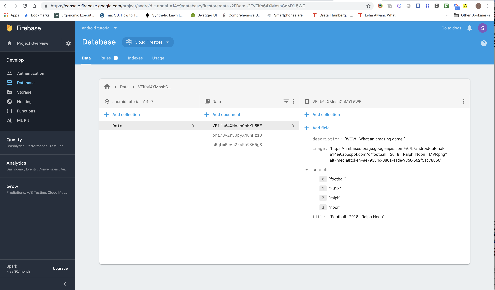
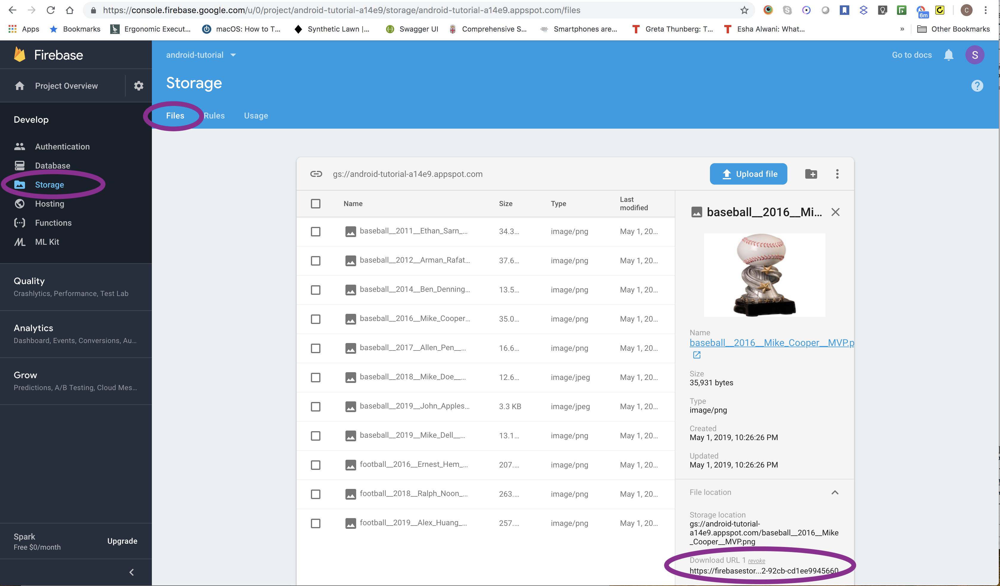

f# Android Tutorial

*******************************************************************************************************************
# Create new branch 'firebase'
*******************************************************************************************************************

## Firebase

We will be adding **Firebase** functionality to existing RecyclerView and search code from the search lesson in branch **search**

#### Add Firebase to your Android project

Follow instructions in https://firebase.google.com/docs/android/setup

#### Upload trophy images to 'Firebase Storage'

1. Open the Firebase **console** on the browser at https://console.firebase.google.com
2. Click on the **android-tutorial** project
3. Click **Storage** from the left menu
4. Click on the **Files** tab
5. Click **Upload file** and upload trophy images from **android-tutorial/images**

#### Define Storage Rules

1. Click on the **Rules** tab
2. Define Rules as follows:

```
    service firebase.storage {
     match /b/{bucket}/o {
      match /{allPaths=**} {
         allow read, write: if true;
        }
    }
    }
```

#### Create trophy records in 'Cloud Firestore'

1. Open the Firebase **console** on the browser at https://console.firebase.google.com
2. Click on the **android-tutorial** project
3. Click **Database** from the left menu
4. Select **Database** -> **Cloud Firestore**
5. Click on the **Data** tab
6. Add data as follows:



**_IMPORTANT_**: To get the URL of an image:
 - go to Firebase **Storage**
 - click on the uploaded image,
 - under File location, click **Download Url**, it will be copied into the clipboard which can then be pasted in the **Cloud Firestore** **image** field.




#### Add Firebase dependencies to module app build.gradle:

*app/build.gradle*
```
    dependencies {

        ...

        //picasso library to retrieve images
        implementation 'com.squareup.picasso:picasso:2.71828'

        // Firebase core
        implementation 'com.google.firebase:firebase-core:16.0.8'

        // Cloud Firestore
        // see https://firebase.google.com/docs/android/setup#available-libraries
        implementation 'com.google.firebase:firebase-firestore:18.2.0'

        // FirebaseUI for Cloud Firestore
        // Used for FirestoreRecyclerAdapter
        // see https://firebaseopensource.com/projects/firebase/firebaseui-android/firestore/readme.md/
        implementation 'com.firebaseui:firebase-ui-firestore:4.3.1'
        ...
    }
```

Note: see https://firebase.google.com/docs/android/setup#available-libraries

#### Connect to Firebase Database Cloud Firestore

1. In **TrophiesActivity.java** add code to access a **Cloud Firestore** instance from the activity and create a reference to the **Data** collection:

*app/src/main/java/com/example/androidtutorial/**TrophiesActivity.java***
```
    public class TrophiesActivity extends AppCompatActivity {

       ...
       FirebaseFirestore mFirebaseDatabase;
       CollectionReference mRef;


        @Override
        protected void onCreate(Bundle savedInstanceState) {
           super.onCreate(savedInstanceState);
           setContentView(R.layout.activity_trophies_list);

           // Access a Cloud Firestore instance from your Activity
           mFirebaseDatabase = FirebaseFirestore.getInstance();
           mRef = mFirebaseDatabase.collection("Data");

           ...
        }

```

2. In **TrophiesActivity.java** remove method **createTrophyData()**, since we will now be getting the data from the **FirestoreRecyclerAdapter** which will get the data from the **Data** in **Cloud Firestore**.

3. In **TrophyAdapter.java** replace the class parent to **FirestoreRecyclerAdapter<Trophy, TrophyViewHolder>** and implement methods **onCreateViewHolder**, **onBindViewHolder** and the following **constructor** :

*app/src/main/java/com/example/androidtutorial/**TrophyAdapter.java***
```
    public class TrophyAdapter extends FirestoreRecyclerAdapter<Trophy, TrophyViewHolder>  {

        public TrophyAdapter(@NonNull FirestoreRecyclerOptions<Trophy> options, Context context, ArrayList<Trophy> trophies) {
            super(options);
        }

        @Override
        public TrophyViewHolder onCreateViewHolder(ViewGroup parent, int viewType) {
            View view = LayoutInflater.from(parent.getContext()).inflate(R.layout.trophies_item, parent, false);
            TrophyViewHolder viewHolder = new TrophyViewHolder(view);
            return viewHolder;
        }

        @Override
        protected void onBindViewHolder(@NonNull TrophyViewHolder TrophyViewHolder, int position, @NonNull Trophy trophy) {
            TrophyViewHolder.setDetails(trophy);
        }
    }
```

3. In **TrophyAdapter.java** remove method **getFilter()**, and in **TrophiesActivity.java** remove the call to **getFilter()**, since the filter will now be done by the **FirestoreRecyclerAdapter**.

4. In **TrophiesActivity.java** add the following code which uses **FirestoreRecyclerOptions**, and **TrophyAdapter** (**FirestoreRecyclerAdapter**) to query the **Cloud Firestore**:

*app/src/main/java/com/example/androidtutorial/**TrophiesActivity.java***
```
        //load data into recycler view onStart
        @Override
        protected void onStart() {
            super.onStart();

            FirestoreRecyclerOptions<Trophy> options = new FirestoreRecyclerOptions.Builder<Trophy>()
                    .setQuery(mRef, Trophy.class)
                    .build();

            adapter = new TrophyAdapter(options,this, trophies);
            // set adapter for recyclerview
            recyclerView.setAdapter(adapter);
            // CLOUD FIRESTORE
            // start listening for recyclerview items from firestore
            adapter.startListening();
        }

```

#### Commit and push all your changes.

*******************************************************************************************************************
# Create new branch 'firebase-search'
*******************************************************************************************************************