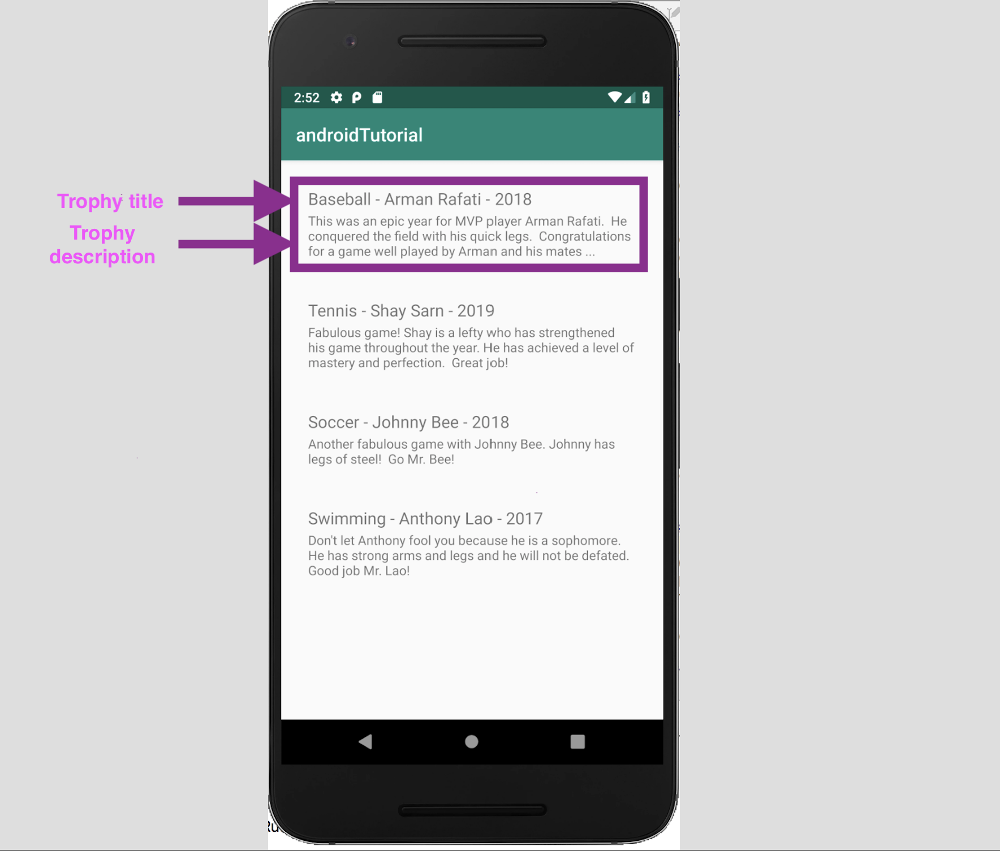
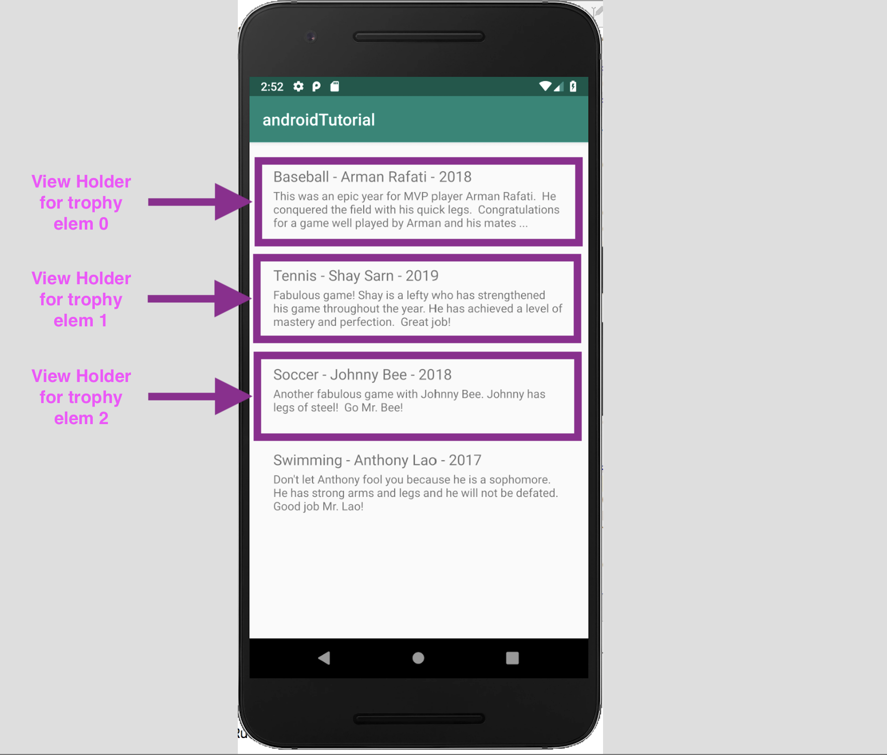
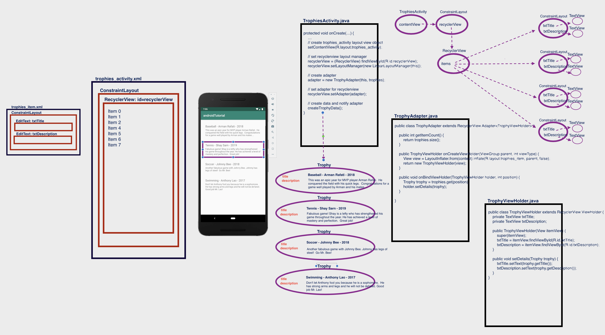

# Android Tutorial

*******************************************************************************************************************
# Create new branch 'recyclerview'
*******************************************************************************************************************

## RecyclerView

In this tutorial we want to display a list of trophies with a **title** and a **description** as follows:



Android **RecyclerView** is the advanced version of ListView for more improvements and features.

In the **RecyclerView** model, several different components work together to display your data.
The overall container for your user interface is a RecyclerView object that you add to your layout.
The **RecyclerView** fills itself with views provided by a **layout manager** that you provide.
You can use one of our standard layout managers (such as LinearLayoutManager or GridLayoutManager), or implement your own.

The views in the list are represented by **view holder** objects.
These objects are instances of a class you define by extending **RecyclerView.ViewHolder**.
Each **view holder** is in charge of displaying a single item with a view.
For example, if your list shows a trophy collection for a sport, each view holder might represent a single trophy.



The **view holder** objects are managed by an **adapter**, which you create by extending **RecyclerView.Adapter**.
The **adapter** creates view holders as needed.
The **adapter** also **binds** the **view holders** to their data.
It does this by assigning the view holder to a position, and calling the adapter's **onBindViewHolder()** method.
That method uses the view holder's position to determine what the contents should be, based on its list position.



#### Add RecyclerView to your layout

- Go to **_trophies_activity.xml_**, open the **Design** tab, and in **Palete** -> **Containers** you will find the **RecyclerView**.
- Drag it to the Contraint Layout.
- You will be asked if you want to add the library to project dependencies, click **Ok**.  When you do, the library will be added to the app/build.gradle file.

The page that we are going to design contains our trophies information with **RecyclerView**.

#### Create a class to hold the Trophy data with *title* and *description*.

In this tutorial we will have a **title** and a **description** for a trophy.

*app/src/main/java/com/example/androidtutorial/**Trophy.java***
```
    public class Trophy {
        String title;
        String description;

        public Trophy(String title, String description) {
            this.title = title;
            this.description = description;
        }

        public String getTitle() {
            return title;
        }

        public void setTitle(String title) {
            this.title = title;
        }

        public String getDescription() {
            return description;
        }

        public void setDescription(String description) {
            this.description = description;
        }
    }
```

#### Create a layout for each trophy item in the RecyclerView.

*app/src/main/java/com/example/androidtutorial/**trophies_item.java***
```
    <?xml version="1.0" encoding="utf-8"?>
    <androidx.constraintlayout.widget.ConstraintLayout xmlns:android="http://schemas.android.com/apk/res/android"
        xmlns:app="http://schemas.android.com/apk/res-auto"
        xmlns:tools="http://schemas.android.com/tools"
        android:layout_width="match_parent"
        android:layout_height="wrap_content"
        android:padding="20dip">

        <TextView
            android:id="@+id/txtTitle"
            android:layout_width="match_parent"
            android:layout_height="wrap_content"
            android:padding="1dp"
            android:textSize="18sp"
            app:layout_constraintEnd_toEndOf="parent"
            app:layout_constraintStart_toStartOf="parent"
            app:layout_constraintTop_toTopOf="parent" />

        <TextView
            android:id="@+id/txtDescription"
            android:layout_width="match_parent"
            android:layout_height="wrap_content"
            android:padding="1dp"
            app:layout_constraintEnd_toEndOf="parent"
            app:layout_constraintHorizontal_bias="0.0"
            app:layout_constraintStart_toStartOf="parent"
            app:layout_constraintTop_toBottomOf="@+id/txtTitle" />

    </androidx.constraintlayout.widget.ConstraintLayout>
```

#### Create an adapter to manage trophy views and data.

To feed all your data to the RecyclerView list, you must extend the RecyclerView.Adapter class.
The adapter creates views for items in the RecyclerView list.

Follow the following steps to create the adapter.

1. Create a trophy **view holder**

The views in the list are represented by view holder objects. These objects are instances of a class
you define by extending RecyclerView.ViewHolder. Each view holder is in charge of displaying a single
item with a view.

*app/src/main/java/com/example/androidtutorial/**TrophyViewHolder.java***
```
    public class TrophyViewHolder extends RecyclerView.ViewHolder {
        private TextView txtTitle;
        private TextView txtDescription;

        public TrophyViewHolder(View itemView) {
            super(itemView);
            txtTitle = itemView.findViewById(R.id.txtTitle);
            txtDescription = itemView.findViewById(R.id.txtDescription);
        }

        public void setData(Trophy trophy) {
            txtTitle.setText(trophy.getTitle());
            txtDescription.setText(trophy.getDescription());
        }
    }
```

2. Create a trophy **adapter** class

*app/src/main/java/com/example/androidtutorial/**TrophyAdapter.java***
```
    public class TrophyAdapter {
        private Context context;
        private ArrayList<Trophy> trophies;

        public TrophyAdapter(Context context, ArrayList<Trophy> trophies) {
            this.context = context;
            this.trophies = trophies;
        }
    }
```

3. Extend the trophy adapter **TrophyAdapter** class from **RecyclerView.Adapter<TrophyViewHolder>** and
   implement override methods **onCreateViewHolder**, **onBindViewHolder** and **getItemCount**.

   ```
   public class TrophyAdapter extends RecyclerView.Adapter<TrophyViewHolder> {
       private Context context;
       private ArrayList<Trophy> trophies;

       public TrophyAdapter(Context context, ArrayList<Trophy> trophies) {
           this.context = context;
           this.trophies = trophies;
       }

       @Override
       public int getItemCount() {
       }

       @Override
       public TrophyViewHolder onCreateViewHolder(ViewGroup parent, int viewType) {
       }

       @Override
       public void onBindViewHolder(TrophyViewHolder holder, int position) {
       }

   }
   ```

4. Change **getItemCount()** method

*app/src/main/java/com/example/androidtutorial/**TrophyAdapter.java***
```
    @Override
    public int getItemCount() {
          return trophies.size();
    }
```

5. Inflate the trophy item layout when a view holder item is created for a trophy item.

**_NOTE_**: **Inflate** means to **render** or **create** the view layuout for each trophy item in the recyclerview list.
Inflate the trophy item layout (**trophies_item.xml**) in method **onCreateViewHolder()**.

*app/src/main/java/com/example/androidtutorial/**TrophyAdapter.java***
```
    @Override
    public TrophyViewHolder onCreateViewHolder(ViewGroup parent, int viewType) {
         View view = LayoutInflater.from(context).inflate(R.layout.trophies_item, parent, false);
         return new TrophyViewHolder(view);
    }
```

6. Bind (set) the trophy item **data** to the trophy item **view**.

Change method **onBindViewHolder()** method to set the data from the trophy item to the view holder.

*app/src/main/java/com/example/androidtutorial/**TrophyAdapter.java***
```
    @Override
    public void onBindViewHolder(TrophyViewHolder holder, int position) {
     Trophy trophy = trophies.get(position);
     holder.setData(trophy);
    }
```

#### Now change your activity code to do the following:

    - set recyclerview layout manager
    - set adapter for recyclerview
    - create data and notify adapter

*app/src/main/java/com/example/androidtutorial/**TrophiesActivity.java***
```
    public class TrophiesActivity extends AppCompatActivity {

        private RecyclerView recyclerView;
        private TrophyAdapter adapter;
        private ArrayList<Trophy> trophies;


        @Override
        protected void onCreate(Bundle savedInstanceState) {
            super.onCreate(savedInstanceState);
            setContentView(R.layout.trophies_activity);

            // - set recyclerview layout manager
            recyclerView = (RecyclerView) findViewById(R.id.recyclerView);
            recyclerView.setLayoutManager(new LinearLayoutManager(this));
            trophies = new ArrayList<>();
            adapter = new TrophyAdapter(this, trophies);
            // set adapter for recyclerview
            recyclerView.setAdapter(adapter);
            // - fill data for recyclerview items
            createTrophyData();
        }

        // - create data and notify adapter
        private void createTrophyData() {
            Trophy trophy;
            trophy = new Trophy("Baseball - Arman Rafati - 2018", "This was an epic year for MVP player Arman Rafati.  He conquered the field with his quick legs.  Congratulations for a game well played by Arman and his mates ... ");
            trophies.add(trophy);
            trophy = new Trophy("Tennis - Shay Sarn - 2019", "Fabulous game! Shay is a lefty who has strengthened his game throughout the year. He has achieved a level of mastery and perfection.  Great job!");
            trophies.add(trophy);
            trophy = new Trophy("Soccer - Johnny Bee - 2018", "Another fabulous game with Johnny Bee. Johnny has legs of steel!  Go Mr. Bee!");
            trophies.add(trophy);
            trophy = new Trophy("Swimming - Anthony Lao - 2017", "Don't let Anthony fool you because he is a sophomore.  He has strong arms and legs and he will not be defated. Good job Mr. Lao!");
            trophies.add(trophy);
            adapter.notifyDataSetChanged();
        }
    }
```

#### Run/Debug the app

#### Commit and push all your changes

#### Review general concepts by watching video tutorial

A decent video tutorial for RecyclerView can be found at https://www.youtube.com/watch?v=Vyqz_-sJGFk

*******************************************************************************************************************
# Create new branch 'search'
*******************************************************************************************************************