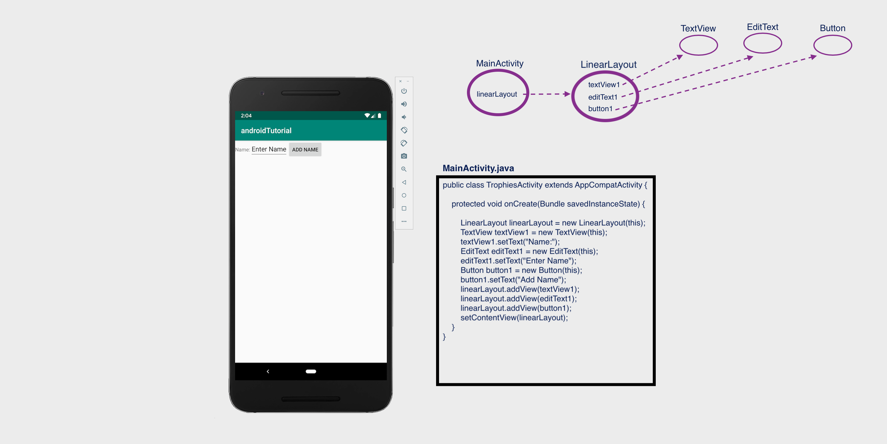

# Android Tutorial

*******************************************************************************************************************
# Open project 'ui-elements-runtime'
*******************************************************************************************************************

## UI Elements

see https://www.tutlane.com/tutorial/android/android-ui-controls-textview-edittext-radio-button-checkbox

In android, we can define a UI in two ways:

- Create UI elements at runtime
- Declare UI elements in XML

The android framework will allow us to use either or both of these methods to define our application’s UI.

## Create UI Elements at Runtime

To create UI elements at runtime, we need to create our own custom View and ViewGroup objects programmatically with required layouts.

Following is the example of creating an UI elements (TextView, EditText, Button) in LinearLayout using custom View and ViewGroup objects in
an activity programmatically.

*app/app/src/main/java/com/example/androidtutorial/MainActivity.java*
```
public class TrophiesActivity extends AppCompatActivity {
    @Override
    protected void onCreate(Bundle savedInstanceState) {
        super.onCreate(savedInstanceState);
        LinearLayout linearLayout = new LinearLayout(this);
        TextView textView1 = new TextView(this);
        textView1.setText("Name:");
        EditText editText1 = new EditText(this);
        editText1.setText("Enter Name");
        Button button1 = new Button(this);
        button1.setText("Add Name");
        linearLayout.addView(textView1);
        linearLayout.addView(editText1);
        linearLayout.addView(button1);
        setContentView(linearLayout);
    }
}
```


**_HINT_**: in Android Studio, use Cmd-Shift-O (or go to "Navigate" -> "File") and type MainActivity.java to see the above code, and
run the app.




*******************************************************************************************************************
# Close project 'ui-elements-runtime' and go back to original project 'android-tutorial'
*******************************************************************************************************************

