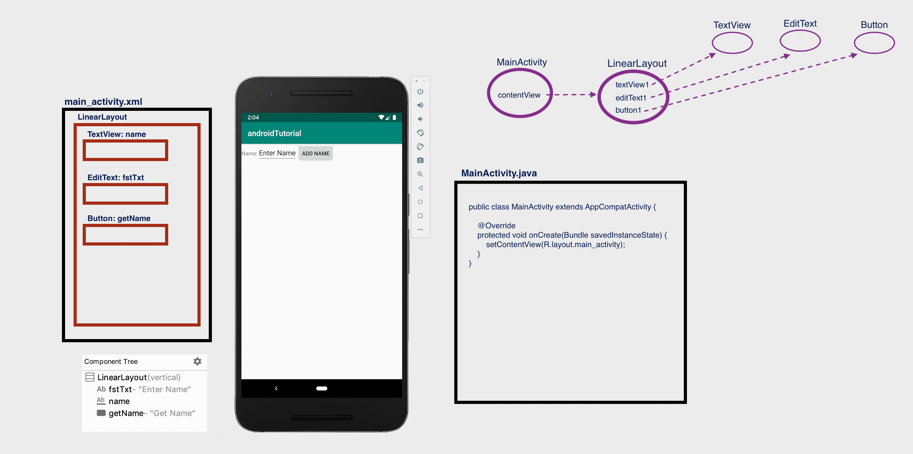

# Android Tutorial

*******************************************************************************************************************
# Open project 'ui-elements-xml'
*******************************************************************************************************************

## Declare UI elements in XML

In android, a page layout is created in XML similarly as web pages are created in HTML.

The layout file must contain only one root element, which must be a View or ViewGroup object.
Once we define root element, then we can add additional layout objects or widgets as child elements to build the
View hierarchy that defines our layout.

Following is an example of defining some UI elements (TextView, EditText, Button) in an XML file (main_activity.xml)
using LinearLayout.

*app/app/src/main/res/layout/main_activity.xml*
```
<?xml version="1.0" encoding="utf-8"?>
<LinearLayout xmlns:android="http://schemas.android.com/apk/res/android"
    android:orientation="vertical"

    android:layout_width="match_parent"
    android:layout_height="match_parent">
    <TextView
        android:id="@+id/fstTxt"
        android:layout_width="wrap_content"
        android:layout_height="wrap_content"
        android:text="Enter Name" />
    <EditText
        android:id="@+id/name"
        android:layout_width="wrap_content"
        android:layout_height="wrap_content"
        android:ems="10"/>
    <Button
        android:id="@+id/getName"
        android:layout_width="wrap_content"
        android:layout_height="wrap_content"
        android:text="Get Name" />
</LinearLayout>
```

**_HINT_**: in Android Studio, use Cmd-Shift-O (or go to "Navigate" -> "File") and type main_activity.xml to see the above xml code.

Also, in file TrophiesActivity.java, method **setContentView(R.layout.main_activity)** is called to **render** the layout file.
Rendering a layout means that the activity will be showing the UI design (with the UI elements) written in the xml file.

In method call **setContentView(R.layout.main_activity)**

- R means Resource

- layout means design

- main_activity is the xml you have created under res->layout->main_activity.xml

For a more detailed explanation of setContentView method, see https://androidride.com/what-setcontentview-android-studio/

**_HINT_**: in Android Studio, use Cmd-Shift-O (or go to "Navigate" -> "File") and type ActivityMain.java to see the above code, and
run the app.



*******************************************************************************************************************
# Close project 'ui-elements-xml' and go back to original project 'android-tutorial'
*******************************************************************************************************************


